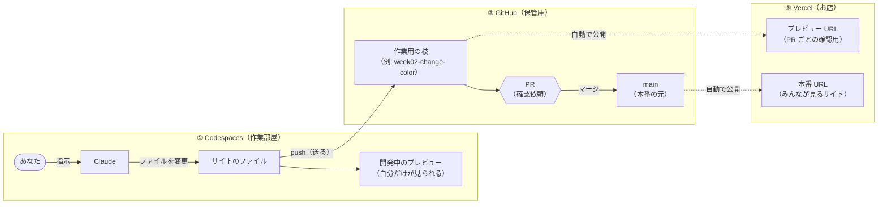
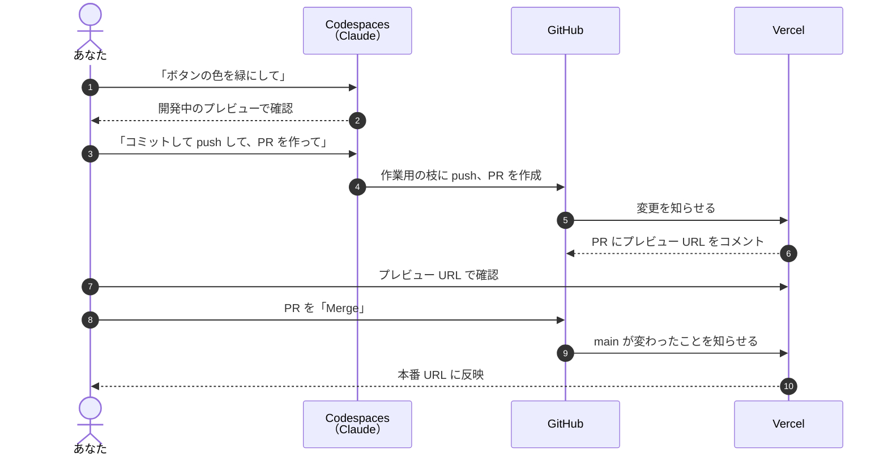

# しくみの図解: Codespaces・GitHub・Vercel

この演習では、3つのサービスを行き来します。
それぞれの役割と、**どの URL で何が見えるか**をまとめました。迷ったらこのページに戻ってきてください。

## 3つの場所の役割

たとえると、**作業部屋**・**保管庫**・**お店**です。

| 場所 | たとえ | 何をするところか | あなたがすること |
| --- | --- | --- | --- |
| **Codespaces** | 作業部屋 | Claude に頼んでサイトを作り、直す。すぐ自分で試せる | Claude に指示する、プレビューで確かめる |
| **GitHub**（github.com） | 保管庫 | ファイルを保管する。変更の記録（コミット）と、確認依頼（PR）を管理する | PR を見る、マージする |
| **Vercel** | お店 | GitHub の中身を受け取り、インターネットに公開する | 公開された URL を開く |

- 実線（→）は**あなたが Claude に頼んで行うこと**です
- 点線（⇢）は**自動で起きること**です。Vercel は GitHub を見張っていて、中身が変わると自動で公開し直します

## 3つの URL の違い

サイトを見る URL は3種類あります。どれも同じサイトですが、**どの時点の中身が見えるか**が違います。

| URL | 例 | 見えるもの | 誰が見られるか | 更新されるタイミング |
| --- | --- | --- | --- | --- |
| **開発中のプレビュー** | `https://〇〇-3000.app.github.dev` | Codespaces で今まさに直しているもの（push 前も含む） | 自分だけ | ファイルが変わるとすぐ |
| **Vercel のプレビュー URL** | `https://travel-plans-git-week02-〇〇.vercel.app` | PR の作業用の枝の中身 | 本人と、URL を共有した人（※ Vercel の設定によっては、Vercel にログインした本人しか開けません） | push するたび（1〜2分後） |
| **本番 URL** | `https://travel-plans-〇〇.vercel.app` | main の中身 | 誰でも | マージしたとき（1〜2分後） |

> **開発中のプレビュー**は、Codespaces を止めると見られなくなります。人に見せるときは Vercel の URL を使います。

## 1回の変更の流れ

第2週以降、毎週この流れを回します。

| 番号 | 段階 | 本番への影響 |
| --- | --- | --- |
| 1〜2 | Codespaces で作って試す | なし |
| 3〜6 | GitHub に送って PR を作る。Vercel がプレビューを作る | なし |
| 7 | プレビュー URL で確かめる | なし |
| 8〜10 | マージする。本番に反映される | **ここで初めて反映** |

**マージするまで、本番のサイトは変わりません。** 安心して試してください。

## よくある「あれ？」

| 状況 | 理由 | どうする |
| --- | --- | --- |
| Codespaces では変わったのに、本番 URL が変わらない | まだ push・PR・マージをしていない | Claude に「push して PR を作って」と頼み、確認してからマージする |
| PR のプレビュー URL が古いまま | 直した後に push していない | Claude に「push して」と頼み、1〜2分待つ |
| マージしたのに本番 URL が変わらない | Vercel が公開し直している途中 | 1〜2分待ってから再読み込みする |
| 開発中のプレビューが開けない | Codespaces が止まっている、またはサイトが起動していない | Codespaces を開き、Claude に「サイトを起動して」と頼む |
| `localhost:3000` と言われたが開けない | Codespaces の中だけの住所 | 「ポート」タブで 3000 番の地球儀アイコンを押す |

## 言葉のおさらい

| 言葉 | 意味 |
| --- | --- |
| コミット | 変更をセーブすること（Codespaces の中） |
| push | セーブした内容を GitHub に送ること |
| ブランチ（枝） | 本番に影響しない作業用のコピー |
| PR | 「この枝の変更を main に入れていいですか」という確認依頼 |
| マージ | 枝の変更を main に合流させること。本番に反映される |
| デプロイ | Vercel がサイトを公開すること（自動） |
