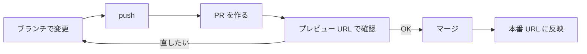

# 第3週: PR とプレビューで、安全に本番へ反映する

## 今週のゴール

「作業用の枝で変える → プレビューで確かめる → マージして本番に反映する」を、自分で1周回せる。

## しくみの全体像



本番のサイトは、`main` という幹の中身で作られています。作業用の枝で変えている間は、本番には影響しません。
PR で「枝の変更を幹に入れてよいか」を確かめ、マージ（合流）した時点で本番に反映されます。

Codespaces・GitHub・Vercel のどこで何が起きているかは、[しくみの図解（how-it-works.md）](how-it-works.md#1回の変更の流れ) の「1回の変更の流れ」で確認できます。

## 1. 先週の PR をマージする

1. GitHub で自分のリポジトリを開き、「Pull requests」タブ → 先週の PR を開く
2. プレビュー URL をもう一度開いて、変更が思った通りか確かめる
3. 画面の下の「Merge pull request」→「Confirm merge」
4. 1〜2分待ってから**本番 URL** を開き、変更が反映されていることを確かめる

## 2. 今週の課題: 1周を自分で回す

次の流れを、Claude に頼みながら自分で進めてください。

1. 「新しいブランチで作業を始めて」と頼む
2. プラン一覧ページを1か所変える（例: カードに「何泊何日」を大きく表示する、価格の表示を「1人あたり ○○円〜」にする など。自分で決めてかまいません）
3. 「コミットして push して、PR を作って」と頼む
4. PR のプレビュー URL で確かめる
5. 直したい所があれば、Codespaces に戻って頼み直す。push すると同じ PR のプレビューが自動で更新されます
6. 思い通りになったら、PR の本文を書いて提出する

**マージは提出の後に自分で行ってください。**

## 3. Claude に聞いてみよう

意味が分からない言葉は、どんどん聞いてかまいません。

```
いま自分がどのブランチにいるか教えて。main とは何が違う？
```

```
この PR がマージされると、本番サイトのどこが変わる？
```

## 4. よくある心配

| 心配 | 答え |
| --- | --- |
| 間違えて本番を壊したら？ | PR の段階なら本番は変わりません。マージ後でも、Claude に「直前のマージを取り消す PR を作って」と頼めば戻せます |
| PR に赤い×が付いた | 自動のビルド確認が失敗しています。Claude に「PR のビルドが失敗している。原因を調べて直して」と頼みます |
| Vercel のコメントが出ない | 数分待ちます。それでも出ないときは [troubleshooting.md](troubleshooting.md) |

## 今週わかったこと

| 言葉 | 意味 |
| --- | --- |
| main | 本番サイトの元になる幹 |
| マージ | 枝の変更を幹に合流させること。この時点で本番に反映される |
| ビルド確認 | PR ごとに「サイトとして組み立てられるか」を自動で試すしくみ |
