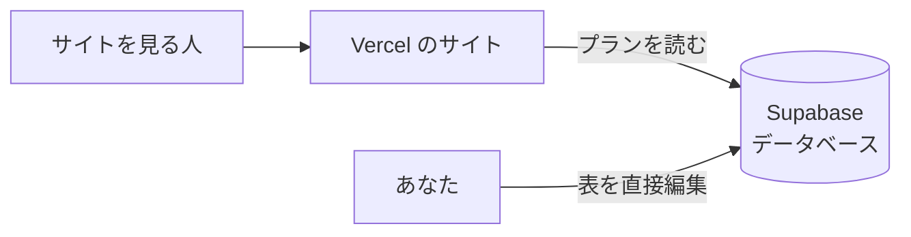

# 第5週: データベースにつなぐ

## 今週のゴール

プランのデータを、ファイル（`data/plans.json`）からデータベース（Supabase）に移す。
Supabase の画面で価格を書き換えると、サイトの表示もすぐ変わる状態にする。

## しくみの全体像

これまでは、プランがサイトのファイルの中に書かれていました。変えるにはファイルを直して公開し直す必要がありました。
データベースに移すと、サイトは表示のたびにデータベースを読みに行くので、**データを直すだけで表示が変わります**。これが「動的なサイト」です。

## 1. Supabase のアカウントとプロジェクトを作る（10分）

1. https://supabase.com を開き、「Start your project」→「Continue with GitHub」
2. 「New project」を押す
3. 次のように入れる
   - Project name: `travel-plans`
   - Database Password: 「Generate a password」で作る（あとで使わないので、控えなくても大丈夫です）
   - Region: **Northeast Asia (Tokyo)**
4. 「Create new project」。準備に1〜2分かかります

> 無料プランで作れるプロジェクトは2つまでです。後半の「自分のアプリ」用に1つ空けておいてください。

## 2. 表を作ってデータを入れる（5分）

1. Codespaces で `supabase/01_plans.sql` を開き、中身を全部コピーする（Ctrl + A → Ctrl + C）
2. Supabase の左のメニューから **SQL Editor** を開く
3. 貼り付けて、右下の **Run** を押す。「Success」と出れば成功です
4. 左のメニューの **Table Editor** →「plans」を開くと、6件のプランが入っています

`01_plans.sql` には、表を作る命令と、「誰でもプランを**見る**ことだけできる」という決まり（RLS）が書いてあります。RLS は第6週で詳しく扱います。

## 3. 接続情報を Codespaces に置く（5分）

サイトが Supabase につなぐには「住所（URL）」と「合言葉（キー）」が必要です。

1. Supabase の画面上部の **Connect** ボタン（または「Project Settings」→「API」）を開く
2. **Project URL** と、**anon キー**（または `sb_publishable_` で始まる publishable キー）を確認する
   - `service_role` キーや `sb_secret_` で始まる secret キーは**使いません**。これはすべての権限を持つ鍵です
3. Codespaces の左のファイル一覧で `.env.example` を右クリック →「コピー」→ 同じ場所で右クリック →「貼り付け」
4. できたファイルの名前を `.env.local` に変える（右クリック →「名前の変更」）
5. `.env.local` を開き、`=` の右にそれぞれ貼り付けて保存する

> `.env.local` は GitHub に送られない設定になっています。キーを Claude への指示文に貼る必要もありません。

## 4. Claude に読み込み先を変えてもらう（30分）

自分の言葉で頼んでみましょう。伝えるべきことは次の3つです。

- 何を: プランの読み込み先を、`data/plans.json` から Supabase の `plans` 表に変えたい
- 準備済みのこと: 接続情報は `.env.local` に入れてある
- 守ってほしいこと: Supabase でデータを変えたら、サイトにもすぐ反映されるようにしたい

Claude が「Supabase 用の部品（ライブラリ）を追加してよいか」と聞いてきたら、了承してかまいません。

終わったら、Claude に「サイトを起動して」と頼み、プレビューでこれまでと同じ6件が出ることを確かめます。

## 5. 「動的」を体験する

1. Supabase の Table Editor で、どれか1つのプランの `price` を書き換えて保存する
2. プレビューを再読み込みする
3. 価格が変わっていれば成功です。ファイルを1文字も直さずに、表示が変わりました

## 6. Vercel にも接続情報を登録する（5分）

本番やプレビューのサイトも Supabase につなぐため、Vercel に同じ値を登録します。

1. Vercel でプロジェクトを開き、「Settings」→「Environment Variables」
2. `.env.local` と同じ名前と値で、2つとも登録する（Environments は全部にチェック）
3. 「Save」

登録の後に作ったプレビューから反映されます。PR を作る前に登録しておきましょう。

## 7. 提出

PR を作って提出します。「結果」欄には、プレビュー URL と、**Supabase で価格を変えたら表示が変わったこと**を書いてください。
Supabase の Table Editor の画面キャプチャを貼るのもおすすめです。

## つまずいたら

| 症状 | 対処 |
| --- | --- |
| プレビューに「Supabase の接続情報がありません」のような表示 | `.env.local` の名前と中身を確認し、Claude に「サイトを再起動して」と頼みます |
| Vercel のプレビューだけ表示されない | Vercel の環境変数を登録したか確認し、Vercel の「Deployments」から「Redeploy」します |
| プランが0件になる | SQL Editor で `01_plans.sql` を実行したか、Table Editor で確認します |
| Supabase の値を変えても表示が変わらない | Claude に「Supabase の変更がすぐ表示されるように、ページが毎回最新を読む設定にして」と頼みます |

## 今週わかったこと

| 言葉 | 意味 |
| --- | --- |
| データベース | データを表の形でしまっておく場所。サイトは表示のたびに読みに行く |
| 環境変数 | 接続先や鍵など、コードに書かずに外から渡す設定 |
| anon キー | 「サイトを見に来た人」として接続する鍵。できることは RLS で決まる |
